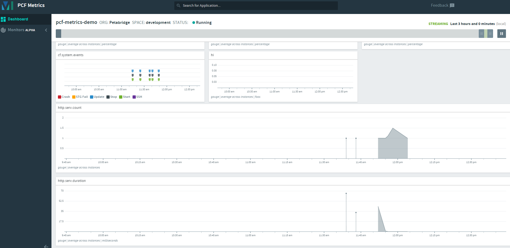

# Petabridge.Monitoring.PCF

A monitoring engine for .NET applications running on [Pivotal's Cloud Foundry (PCF) platform](https://pivotal.io/platform).

This component targets the [PCF Metrics Forwarder](https://docs.pivotal.io/metrics-forwarder/installing.html), an HTTP API that can be used to inject metrics directly into the PCF loggregator stream. Any metrics recorded by this component will be directly visible inside PCF's built-in PCF Metrics application. 

`Petabridge.Monitoring.PCF` supports the following types of metrics:

1. **Counters** - used for measuring throughput or frequency per second;
2. **Gauges** - used to measure values over time (i.e. changes in the size of a queue length or size of message); and
3. **Timings** - used to measure durations measured in milliseconds.

The PCF Metrics Forwarder only natively supports gauges, so this driver does some work under the covers to adapt the other metrics types on your behalf.

We developed this driver to support our customers who are running .NET applications on PCF and intend on supporting this driver perpetually. It is [licensed under Apache 2.0](LICENSE).

This driver is built to be extremely memory-efficient, thread-safe, and highly concurrent - it's powered by [Akka.NET](http://getakka.net/) actors under the hood.

## Quickstart
To get started with `Petabridge.Monitoring.PCF`, install the following NuGet package:

```
PS> Install-Package Petabridge.Monitoring.PCF
```

And then create an instance of the `PcfMetricsRecorder` class:

```
var metrics = PcfMetricRecorder.Create();
metrics.IncrementCounter("http.serv"); // record a counter (increment by 1)
metrics.IncrementCounter("http.serv");
```

Typically you don't need to explicitly pass in any configuration elements for the `PcfMetricRecorder` to work correctly. We're able to extract all of the necessary credentials and authentication information from the `PcfEnvironment` class defined inside [the `Akka.Bootstrap.PCF` package](https://github.com/petabridge/akkadotnet-bootstrap/tree/dev/src/Akka.Bootstrap.PCF), which we take as a dependency.

### Integrating with Akka.NET
If you're intending on using PCF alongside Akka.NET and you want `Petabridge.Monitoring.PCF` to leverage your pre-existing [`ActorSystem`](http://getakka.net/api/Akka.Actor.ActorSystem.html) instead of creating a new one, you can adjust the call to `PcfMetricsRecorder.Create` accordingly:

```
var mySys = ActorSystem.Create("foo"); // your ActorSystem
var metrics = PcfMetricsRecorder.Create(mySys);
```

This will cause the `PcfMetricsRecorder` to hook its reporting infrastructure into your `ActorSystem` instead of creating its own.

## Trying out `Petabridge.Monitoring.PCF` on PCF
If you want to try this solution out on Pivotal Cloud Foundry, this solution ships with a [PCF manifest](manifest.yml) and a [basic demo web application](src/Petabridge.Monitoring.PCF.Demo) that are ready for deployment on PCF immediately.

If you have the [PCF CLI installed](https://docs.cloudfoundry.org/cf-cli/getting-started.html):

* [Install the PCF Metrics Forwarder](https://docs.pivotal.io/metrics-forwarder/installing.html) and make it available in the space you'll be using for deployment;
* clone this repository;
* edit the `manifest.yml` file to include your application settings. Specifically, you'll want to edit the `services` section to include the name of your PCF Metrics Forwarder service.

And then execute the following command:

```
PS> cf push pcf-akka-demo -b https://github.com/cloudfoundry/dotnet-core-buildpack.git
```

Once the deployment goes through, if you click around on the web application a couple of times you should see some metrics show up inside PCF Metrics under the heads `http.serv.count` and `http.serv.duration`, a counter and a timer respectively.



## Building this solution
To run the build script associated with this solution, execute the following:

**Windows**
```
c:\> build.cmd all
```

**Linux / OS X**
```
c:\> build.sh all
```

If you need any information on the supported commands, please execute the `build.[cmd|sh] help` command.

This build script is powered by [FAKE](https://fake.build/); please see their API documentation should you need to make any changes to the [`build.fsx`](build.fsx) file.

#### Previewing Documentation
To preview the documentation for this project, execute the following command at the root of this folder:

```
C:\> serve-docs.cmd
```

This will use the built-in `docfx.console` binary that is installed as part of the NuGet restore process from executing any of the usual `build.cmd` or `build.sh` steps to preview the fully-rendered documentation. For best results, do this immediately after calling `build.cmd buildRelease`.

### Release Notes, Version Numbers, Etc
This project will automatically populate its release notes in all of its modules via the entries written inside [`RELEASE_NOTES.md`](RELEASE_NOTES.md) and will automatically update the versions of all assemblies and NuGet packages via the metadata included inside [`common.props`](src/common.props).

If you add any new projects to the solution created with this template, be sure to add the following line to each one of them in order to ensure that you can take advantage of `common.props` for standardization purposes:

```
<Import Project="..\common.props" />
```

This library is maintained by Petabridge®. Copyright 2018.